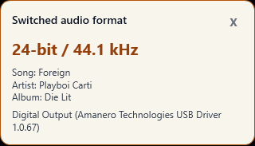
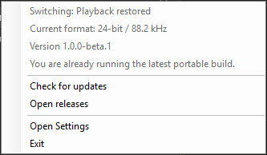
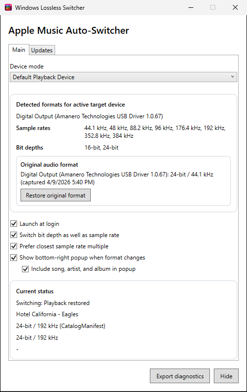

# Windows Lossless Switcher

[](https://github.com/jordanmgibson/WindowsLosslessSwitcher/actions/workflows/ci.yml)

Windows Lossless Switcher switches your audio device's sample rate to match the currently playing lossless song in Apple Music for Windows, automatically.

If the next song you play is a Hi-Res Lossless track at 192 kHz, the app switches your playback device to that sample rate as soon as possible. The opposite happens when the next track has a lower sample rate. Without it, Windows keeps your device at one fixed format and resamples everything to it.

The app lives in the system tray and stays out of the way. It is an independent Windows counterpart to [LosslessSwitcher](https://github.com/vincentneo/LosslessSwitcher) on macOS.

<p align="center">
  
  &nbsp;&nbsp;
  
</p>
<p align="center">
  
</p>

## Features

- Automatic sample-rate and optional bit-depth switching for Apple Music for Windows
- Exact format matching against the Apple Music catalog; local files are matched to their actual file format
- Follows the Windows default playback device, or pins a specific device
- Mutes instantly on a track change so nothing plays at the old format, switches the device live under Apple Music's running audio stream, and unmutes once the rebuilt pipeline produces real audio — no pops, no wrong-format playback, no pause/resume games, and song endings play in full
- Verifies audio is actually flowing after every switch, with automatic recovery if Apple Music's player stalls
- Optional popup toast when a new format is applied
- Tray-first UI with current format display, diagnostics export, and update checks
- Installer with in-app updates, or a portable package if you prefer no installer

## Installation

1. Go to the [latest release](https://github.com/jordanmgibson/WindowsLosslessSwitcher/releases/latest).
2. Download `WindowsLosslessSwitcher-win-x64-Setup.exe` (or the `win-arm64` variant for ARM devices).
3. Run it. The app starts in the system tray.

Prefer no installer? Download `WindowsLosslessSwitcher-win-x64-Portable.zip` instead, extract it, and run `WindowsLosslessSwitcher.exe`.

Worth knowing:

- Releases are currently unsigned, so Windows SmartScreen may warn on first run. Use "More info" → "Run anyway" if you trust the download. In-app updates are not affected by SmartScreen once installed.
- The `win-arm64` packages are built from the same pipeline but have not yet been tested on real ARM hardware — feedback welcome.
- Installed builds check GitHub Releases for updates and can download and restart to apply them from the tray menu. Portable builds point you at the right download instead.
- Launch at login can be enabled in the app's settings.

## Requirements

- Windows 11, x64 or ARM64. Windows 10 (version 2004 / build 19041 or later) is experimental — Apple Music itself runs there despite its Store listing, and Windows 10 support is currently being validated with community testers
- Apple Music for Windows (Microsoft Store version 1.1540.23042.0 or higher), with High-Res Lossless enabled in its audio quality settings
- An audio device where the shared-mode format matters to you — typically an external DAC, AVR, or USB audio interface

### Getting the cleanest output

Apple Music on Windows has no exclusive mode. A clean path through the shared-mode mixer at full volume is what comes closest to one — the nearest equivalent to the exclusive modes in Amazon Music or Tidal. Unless you are deliberately using software EQ (such as Equalizer APO), set up the following once:

- Set the volume to 100% in three places: Apple Music's own volume slider, the system volume, and Apple Music in the Volume Mixer (Settings → System → Sound → Volume mixer).
- Turn off audio enhancements for your DAC/receiver: Settings → System → Sound → select your device under Output → Properties → set Audio enhancements to Off.
- Also uncheck the legacy enhancements setting, which is separate: Settings → System → Sound → More sound settings → Playback → your DAC/receiver → Properties → Advanced → uncheck "Enable audio enhancements".
- Turn off spatial sound (same device properties page) and any effects in your device driver's own control panel.

## How it works

Apple Music for Windows reports the current track through the Windows media session APIs. On each track change, the app resolves the most likely playback format in three layers:

1. **Catalog match** — the track is looked up in Apple Music's web catalog; a confident match yields the exact lossless format (for example 24-bit / 96 kHz).
2. **Local file match** — local-library files and tracks the catalog cannot identify are matched to the actual format of the file in Apple Music's cache.
3. **Tier fallback** — when neither layer can identify the track, the device is set to a format derived from your Apple Music audio-quality setting (High-Res Lossless → 24-bit / 192 kHz, Lossless → 24-bit / 48 kHz), so the applied format always matches what the app resolved.

When a switch is needed, the app mutes the device the instant the track changes (so nothing is audible at the old format) and applies the new shared-mode format live, under Apple Music's running audio stream. Windows invalidates the stream and Apple Music rebuilds it on its own within a few seconds; once real audio is confirmed, the app unmutes. If playback ever stalls anyway, an escalating recovery (nudge → skip → as a last resort an automatic Apple Music restart) brings it back.

Do also note that:

- A track that needs a format switch starts with a few seconds of silence — that is the mute/switch/rebuild cycle doing its job. Audio then comes in at the correct format a few seconds into the track, and its ending is not cut short. Tracks that don't need a switch start instantly.
- Catalog matching depends on Apple's public web catalog. If Apple changes it, exact matching may degrade until the app is updated; the fallback layers keep working in the meantime.

## Settings

Settings are stored at `%APPDATA%\WindowsLosslessSwitcher\settings.json`, and diagnostics logs are written to the same folder. (Versions before 1.0.0-beta.1 used `%LOCALAPPDATA%\WindowsLosslessSwitcher`; existing settings and logs are moved over automatically on first launch.) The common options are available from the app's window; the full file reference:

```jsonc
{
  // "followDefault" tracks whichever device Windows has set as the default playback device.
  // "pinnedDevice" targets the device identified by pinnedDeviceId instead.
  "deviceSelectionMode": "followDefault",

  // Required when deviceSelectionMode is "pinnedDevice". Ignored otherwise.
  // Value is the Windows device ID string (e.g. "{0.0.0.00000000}.{guid}").
  "pinnedDeviceId": null,

  // Register the app to start automatically when Windows starts.
  "launchAtLogin": false,

  // When true, the app also switches the bit depth of the target device (e.g. 16-bit → 24-bit).
  // When false, only the sample rate is adjusted.
  "switchBitDepth": true,

  // Default bit depth applied when the resolved format does not specify one.
  // Accepted values: 16 or 24.
  "defaultBitDepth": 24,

  // When true, prefer the nearest sample-rate multiple of the source format over an exact match.
  // Useful for DACs that handle 44.1/88.2/176.4 kHz more cleanly than mixed-rate output.
  "preferClosestSampleRateMultiple": false,

  // Show a brief popup toast in the corner of the screen when a new format is applied.
  "enableSwitchToasts": false,

  // Include track title and artist in switch toasts. Requires enableSwitchToasts to be true.
  "includeTrackMetadataInSwitchToasts": false,

  // Write verbose per-operation diagnostic entries to the log file.
  // Disable if the log grows too quickly during normal use.
  "enableVerboseDiagnostics": true,

  // Last-resort recovery: when playback wedges repeatedly and every lighter recovery fails,
  // restart Apple Music automatically (its play queue may reset — Apple Music cannot restore
  // it across restarts). Disable to keep recovery limited to nudges and track skips.
  "restartAppleMusicOnPlaybackFailure": true,

  // Set by the app when it captures a pre-switch device format for later restoration.
  // Edit or remove this field to reset the saved restore point.
  "originalTarget": null
}
```

## Troubleshooting

- If no target device is available, refresh devices from the UI and confirm the selected render endpoint still exists.
- If exact matching stops working after an Apple Music update, export diagnostics from the app window and open an issue — catalog matching or fallback ordering may need adjustment.
- If the app is already running, a second launch will exit and the existing instance will remain active in the tray.

When filing a bug, attach the diagnostics export (available from the app window) after checking it for anything you consider personal.

## Why make this?

Apple Music can stream lossless audio up to 24-bit / 192 kHz, but on Windows it never changes the playback device's format to match. Your DAC sits at whatever rate is set in the Sound control panel, and everything gets resampled to it — unless you manually change the format for every track. macOS users have had [LosslessSwitcher](https://github.com/vincentneo/LosslessSwitcher) for this since 2022; there was no equivalent for Apple Music on Windows, so this project fills that gap, free and open source.

## Devices tested

Combinations reported to work by users. Regardless, you use the app at your own risk.

| Windows version | Apple Music version | Audio device |
| --------------- | ------------------- | ------------ |
| Windows 11 25H2 | 1.1540.23042.0 | Geshelli J3 w/ Amanero USB Module |

If it works with your setup, add a row to this table by opening a pull request!

## Disclaimer

By using Windows Lossless Switcher, you agree that under no circumstances will the developer or any contributors be held responsible or liable in any way for any claims, damages, losses, expenses, costs or liabilities whatsoever or any other consequences suffered by you or incurred by you directly or indirectly in connection with any form of usage of Windows Lossless Switcher.

## Building from source

Requires the .NET 8 SDK on Windows.

```powershell
dotnet build .\WindowsLosslessSwitcher.sln
dotnet test .\WindowsLosslessSwitcher.sln
dotnet run --project .\src\WindowsLosslessSwitcher.csproj
```

See [DEVELOPMENT.md](DEVELOPMENT.md) for the architecture and [CONTRIBUTING.md](CONTRIBUTING.md) for contribution guidelines.

## Credits

- [LosslessSwitcher](https://github.com/vincentneo/LosslessSwitcher) by @vincentneo — the macOS original this project takes its idea and name from. This Windows version is an independent implementation adapted to Windows audio APIs, Windows packaging, and Apple Music for Windows.
- [NAudio](https://github.com/naudio/NAudio) — Core Audio access from .NET.
- [Velopack](https://github.com/velopack/velopack) — installer packaging and the update flow.

See [THIRD_PARTY_NOTICES.md](THIRD_PARTY_NOTICES.md) for the full list of third-party components and their licenses.

## License

Windows Lossless Switcher is licensed under `GPL-3.0-or-later`. See [LICENSE](LICENSE).
